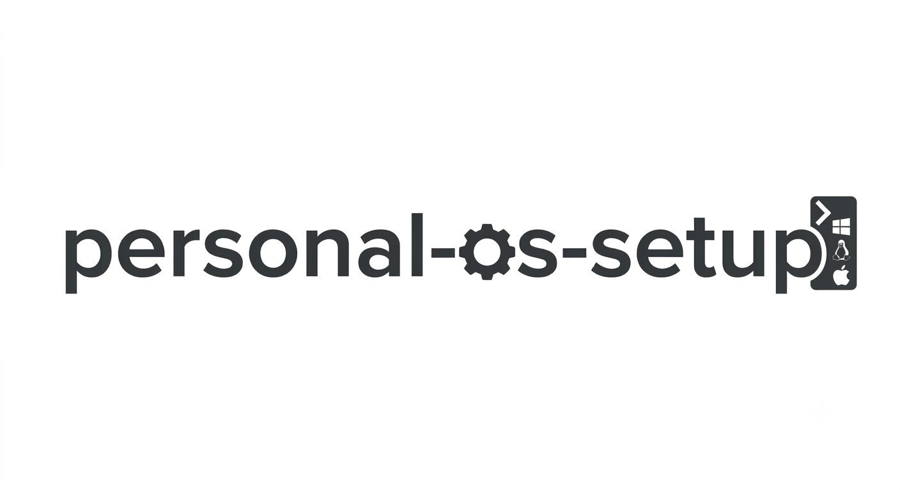
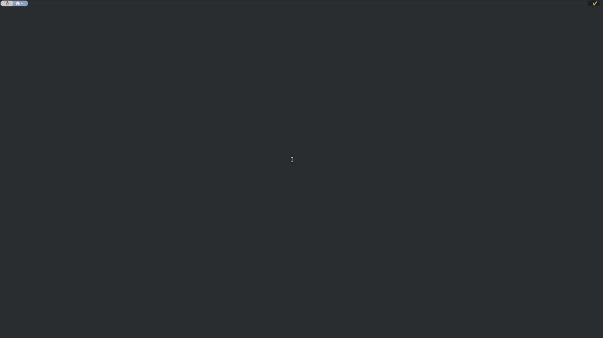

# Personal OS Setup


[](https://www.microsoft.com/en-in/windows)


[](https://github.com/AmineDjeghri/personal-os-setup/actions/workflows/ci.yml)
[](LICENSE)
[](http://personal-os-setup.aminedjeghri.com/)
[](https://github.com/AmineDjeghri/personal-os-setup)



| App Showcase                                            |
|---------------------------------------------------------|
|  |

An opinionated **terminal UI app + documentation hub** for a fast, consistent setup across **Windows**, **Linux**, **macOS**, **WSL2**, your **living room** (Google TV + Stremio), and your **home server** (Home Assistant). Click through the TUI to install packages, configure Zsh/dotfiles/WSL/GPU drivers, and more — one tool for all four OSes.

> [!NOTE]
> **Update notes**
>
> | Platform           | Version / Details       | Updated     |
> |--------------------|-------------------------|-------------|
> | macOS              | 26                      | July 2026   |
> | CachyOS            | Linux `7.1.8-1-cachyos` | August 2026 |
> | Ubuntu (server)    | 24/26                   | June 2026   |
> | Windows 11 / WSL 2 | 11                      | May 2026    |


**Table of contents**
<!-- TOC -->
* [Personal OS Setup](#personal-os-setup)
    * [Get started](#get-started)
      * [Linux / WSL2 / macOS](#linux--wsl2--macos)
      * [Windows 11](#windows-11)
  * [Contributing (For developers)](#contributing-for-developers)
    * [Developer / editor (clone from source)](#developer--editor-clone-from-source)
  * [What is this repo?](#what-is-this-repo)
<!-- TOC -->

### Get started

> [!TIP]
> Want to edit the code, or fork and customize this project? See [Developer / editor (clone from source)](#developer--editor-clone-from-source) below.

#### Linux / WSL2 / macOS
Get started with one command in bash/zsh:

```bash
sh -c "$(wget https://raw.githubusercontent.com/AmineDjeghri/personal-os-setup/main/install_unix.sh -O -)"
```

The script installs the repository into `~/.personal-os-setup` (or reuses/updates it if it already exists there) and links a `personal-os-setup` command into `~/.local/bin`, so you can run it again from anywhere. If you already have the repo cloned and run the script from inside it, it updates that checkout in place instead.

Once installed, just run:

```bash
personal-os-setup
```

#### Windows 11
Get started with one command (run it in PowerShell as administrator):
```powershell
$u='https://raw.githubusercontent.com/AmineDjeghri/personal-os-setup/main/install_windows.ps1'; $p="$env:TEMP\install_windows.ps1"; iwr $u -UseBasicParsing -OutFile $p; powershell -ExecutionPolicy Bypass -File $p
```

The script installs the repository into `%USERPROFILE%\.personal-os-setup` (or reuses/updates it if it already exists there) and adds a `personal-os-setup` command to your PATH, so you can run it again from anywhere. If you already have the repo cloned and run the script from inside it, it updates that checkout in place instead.

Once installed, just run:

```bash
personal-os-setup
```

> [!NOTE]
> The app **auto-updates on every launch**: it runs a `git pull` on the installed checkout before starting the UI, so you're always on the latest version without doing anything manually.

## Contributing (For developers)
### Developer / editor (clone from source)

> [!WARNING]
> If you decide to fork the original repository (AmineDjeghri/personal-os-setup):
>
> It is advised that your fork stays ahead of the original repository at all times, never behind, to always have the latest features. Avoid using GitHub's UI to sync or resolve divergence.
> Add the original repo (AmineDjeghri/personal-os-setup) as `upstream` remote git branch:**
>  ```bash
>  git remote add upstream https://github.com/AmineDjeghri/personal-os-setup.git
>  git fetch upstream
>  ```
> `fetch` only downloads `upstream`'s history — it never touches your working tree or branch.
> You can run the full merge and resolve conflicts interactively, as long as you're deliberate about which side wins per file.
> This will conflict on most shared files (as noted above) plus anything fork-specific that `upstream` also touched.
> review the final diff (`git diff --staged` or the IDE's local changes view) before committing the merge.


> [!TIP]
> **Try it in a VM first**: `make vm-cachyos` / `make vm-ubuntu-server` / `make vm-ubuntu` spin up disposable KVM/QEMU/libvirt VMs so you can test this setup before running it on your real machine. Any Linux host; see [docs/linux/CachyOS.md](docs/linux/CachyOS.md#testing-this-project-in-a-vm) for the full command list.

> [!TIP]
> **Using Claude Code or an agent?** This repo ships skills under `.claude/skills/` to help you add features, write tests, and more with this codebase's conventions already baked in.

If you want to edit the code or fork and customize this project, clone it instead of using
the one-liners above:

```bash
git clone https://github.com/AmineDjeghri/personal-os-setup.git   # or your fork's URL
cd personal-os-setup
./install_unix.sh          # Linux / WSL2 / macOS
# ./install_windows.ps1    # Windows 11 (PowerShell as administrator)
# or make install-dev && make run
```

Running the installation script from inside an existing clone updates that checkout in place
instead of creating a separate `~/.personal-os-setup` copy, so the `personal-os-setup`
command runs your local, editable checkout.

Check the [CONTRIBUTING.md](CONTRIBUTING.md) file for more information.


## What is this repo?

A cross-OS Python **TUI app** (Windows, Linux, macOS, WSL2) for installing packages and running system actions — Zsh/Oh-My-Zsh, WSL management, GPU drivers, dotfiles sync (chezmoi), Windows Terminal config, Docker post-install, and more — plus a **documentation hub** covering the same platforms, TV setup (Google TV + Stremio), and a home server (Home Assistant).

Full feature list, supported package managers, and the docs index: **[personal-os-setup.aminedjeghri.com](http://personal-os-setup.aminedjeghri.com/)**

**For Windows users: Why you should use WSL2?**
WSL2 enables users to run Linux applications and use command-line tools natively on their Windows machines.
This integration allows users
to enjoy the familiarity of Windows while simultaneously harnessing the power and flexibility of Linux.
Also, a surprising number of Linux GUI apps can run on WSL. GUI applications are officially supported on WSL2 and
referred to as [WSLg](https://github.com/microsoft/wslg)(No installation required).

|              | macOS                                                                         | Linux                                                                      | Windows with WSL                                                                                                                                                                                                                          |
|--------------|-------------------------------------------------------------------------------|----------------------------------------------------------------------------|-------------------------------------------------------------------------------------------------------------------------------------------------------------------------------------------------------------------------------------------|
| Advantages   | (+) Excellent for coding and video editing. Supports Adobe & Office products. | (+) Ideal for coding and gaming, providing good performance in both areas. | - (+) Seamless compatibility with diverse software, including Adobe & Office products. </br> (+) Optimal choice for gaming enthusiasts </br> (+) Well-suited for coding with Windows Subsystem for Linux (WSL) and no need for dual boot. |
| Inconvenient | (-) Limited gaming capabilities compared to Windows & Linux.                  | (-) Lacks support for Adobe & Office products and certain software.        | (-) UI is not smooth and responsive compared to macOS & Linux                                                                                                                                                                             |

Within the domain of development, Unix-based systems such as Linux and macOS frequently garner attention. Nevertheless,
the integration of WSL allows smooth coding alongside the utilization of Adobe and Microsoft products that may lack
support on Linux. This flexibility, coupled with the ability to handle resource-intensive games beyond macOS
capabilities, positions Windows-WSL as an enticing platform, ensuring a well-rounded computing experience for all users,
regardless of their workplace constraints.

Based on your needs, you can choose your OS.


[](https://star-history.dera.page/#AmineDjeghri/personal-os-setup)
