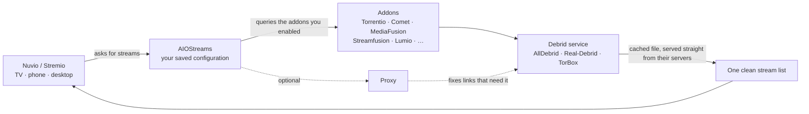

# Nuvio / Stremio + AIOStreams

This page takes you from nothing to a working streaming setup on **Nuvio** (everything below applies to **Stremio** as well), then covers the advanced parts: how the pieces relate, sharing your configuration, keeping several configurations, and changing one setting per device.

- **Part 1 — Quick start**: follow the steps, you are watching in about thirty minutes.
- **Part 2 — Advanced**: how it all works, and the options you only need later.

**Table of contents**
<!-- TOC -->
* [Nuvio / Stremio + AIOStreams](#nuvio--stremio--aiostreams)
  * [How the pieces fit together](#how-the-pieces-fit-together)
  * [Part 1 — Quick start](#part-1--quick-start)
    * [Step 1 — What you need](#step-1--what-you-need)
    * [Step 2 — Create your Nuvio account](#step-2--create-your-nuvio-account)
    * [Step 3 — Subscribe to a debrid service](#step-3--subscribe-to-a-debrid-service)
    * [Step 4 — Load a ready-made configuration](#step-4--load-a-ready-made-configuration)
    * [Step 5 — Give it your debrid account](#step-5--give-it-your-debrid-account)
    * [Step 6 — Install the addon in Nuvio](#step-6--install-the-addon-in-nuvio)
    * [Step 7 — Test it](#step-7--test-it)
    * [Step 8 — If something doesn't work](#step-8--if-something-doesnt-work)
  * [Part 2 — Advanced](#part-2--advanced)
    * [🧩 What is AIOStreams?](#-what-is-aiostreams)
    * [🔗 Template or parent config?](#-template-or-parent-config)
    * [🌱 Setting up a child configuration](#-setting-up-a-child-configuration)
    * [🔀 Turning an addon off for one device (variant)](#-turning-an-addon-off-for-one-device-variant)
    * [🧾 Reading the stream list](#-reading-the-stream-list)
    * [(Optional) — Custom addons you can plug in](#optional--custom-addons-you-can-plug-in)
    * [🔌 Proxy (optional)](#-proxy-optional)
    * [👤 Profiles in Nuvio](#-profiles-in-nuvio)
    * [🗂️ Manage Nuvio from nuvio.tv (Website)](#-manage-nuvio-from-nuviotv-website)
    * [Collections](#collections)
    * [💡 Nuvio/Stremio Tips](#-nuviostremio-tips)
    * [Useful Stremio/Nuvio Resources](#useful-stremionuvio-resources)
<!-- TOC -->

## How the pieces fit together

Five words are enough to follow the rest of this page:

- **Addon** — a source of streams or catalogs. Torrentio, Comet, MediaFusion, Streamfusion and Lumio are addons.
- **Debrid service** — the paid account that turns torrent sources into instant, high-speed playback (AllDebrid, Real-Debrid, TorBox…). You need one account, whatever you do next.
- **Configuration (config)** — the AIOStreams page where you pick your addons, filters, sorting and formatting. It is saved online and reached with a **UUID** plus a **password**.
- **Template** — a JSON file that fills a configuration. That is how this guide hands you a ready-made setup.
- **Parent config** — a configuration that another configuration inherits from. Optional, for when you keep several.

## Part 1 — Quick start

### Step 1 — What you need

- A **Nuvio** account (free) — or Stremio, the steps are the same.
- A **debrid** subscription (AllDebrid, Real-Debrid or TorBox). AllDebrid is what this guide is built around.
- The **configuration link** from step 4 of this page.
- A computer makes the website part more comfortable, but a phone is enough.

If you have never used Stremio, this [fast tutorial](https://arnav.au/2025/04/16/stremio-torrentio-debrid-how-to-guide/) gives the concepts, and [this detailed one](https://guides.viren070.me/stremio/) covers everything. The steps below are self-contained.

### Step 2 — Create your Nuvio account

1. Create your account on [nuvio.tv](https://nuvio.tv) and install the app: [Nuvio](https://nuvioapp.space/) is available on Android, iOS, Android TV and desktop.
2. Log in with the same account on every device — **addons and settings sync between them**.
3. Do the rest of the setup on the website or on the app, whichever you prefer; the website has the better overview for accounts, profiles and integrations.

### Step 3 — Subscribe to a debrid service

A debrid service is an unrestricted multi-hoster: it fetches the torrent on its own servers and hands you the file at full speed, so your TV never downloads a torrent and you do not need a VPN. Most of the catalogue is already cached, which means instant playback.

1. Subscribe to [AllDebrid](https://alldebrid.com/) — **do not choose the free trial, it does not work for this**. Real-Debrid or TorBox work too.
2. Keep the account open in a browser tab: you will need to authorise your IP address later (step 7).
3. You only ever need **one** debrid account, whatever else you do in Part 2.

### Step 4 — Load a ready-made configuration

1. Open the AIOStreams page: 👉 [https://aiostreamsfortheweebs.midnightignite.me/](https://aiostreamsfortheweebs.midnightignite.me/) — you can also use [AIOStreams (ElfHosted)](https://aiostreams.elfhosted.com/), but it is limited to 10 addons and has no Torrentio support.
2. Go to **Our Configuration → Browse ready-made setups → the import button** and paste one of these links:
    - (Recommended) **Amine's default config (essentials)** — nothing to fill in beyond your debrid service:
      `https://raw.githubusercontent.com/AmineDjeghri/personal-os-setup/main/docs/android-tv/aiostreams-template-essentials.json`
    - (Advanced) **Amine's default config (full)** — the same, plus custom addons (Lumio, Live TV Sports, more catalogs…) that need a URL of your own (see the custom addons section in Part 2):
      `https://raw.githubusercontent.com/AmineDjeghri/personal-os-setup/main/docs/android-tv/aiostreams-template-full.json`
3. Click **Use this template now**.
4. Click again on **Our Configuration → Browse ready-made setups**, choose the imported template and click **Use this setup**. The addons, filters, sorting and the stream formatter load automatically; AllDebrid is already wired into the stream addons.
5. Save the configuration: that is what creates your **UUID** and **password**. **Keep both** — they are your AIOStreams login and let you restore the whole setup on any device.

### Step 5 — Give it your debrid account

- If you subscribed to **AllDebrid**, there is nothing to do: the template already points the stream addons at it.
- If you use **Real-Debrid** or **TorBox**, enable your service in the **Services** section and switch each stream addon to it — it is one dropdown per addon.
- With the **full** template, the custom addons arrive **enabled with an empty URL**, and AIOStreams highlights those unfilled fields before you save. Fill the ones you want (their own sites are listed in Part 2) or switch them off in the **Addons** tab — if the save refuses an empty field, put anything in it and disable that addon in the **Addons** tab instead.
- If an addon gives you trouble, just disable it in the **Addons** tab and save again.

### Step 6 — Install the addon in Nuvio

1. Go to the **Save and Install** section.
2. Click **Save**. If you see a timeout error naming an addon, that addon is down at that moment — disable it and save again (Streamfusion and OpenSubtitles V3+ are the usual suspects).
3. Click **Install**, then copy the manifest link.
4. Paste it in Nuvio: [nuvioapp.space/account?tab=addons](https://nuvioapp.space/account?tab=addons) (or through the app).
5. If the link ever changes, the addon has to be reinstalled with the new one — editing the URL in place is not enough.

### Step 7 — Test it

Open any movie or series in Nuvio: you should see your addons providing streams — Statusio appears in the list only if you installed it — with the decorator emojis described in [Reading the stream list](#-reading-the-stream-list).

The last thing to do is authorise your IP address on the debrid service: since the addons are hosted on different servers, your debrid account sees a new IP and blocks cached access until you confirm it. Start any stream, go to your debrid account page, accept the prompt — cached streams switch from ⏳ to ⚡️.

### Step 8 — If something doesn't work

- **Every stream shows ⏳ and none ⚡️** — your debrid account has not validated your IP yet: start a stream, then accept the prompt on the debrid website.
- **A timeout error naming an addon when you save** — that addon is down; disable it and save again.
- **The addon does not appear in Nuvio** — the manifest link was not accepted: copy it again from *Save and Install* and re-add it.
- **You lost your UUID or password** — they belong to your AIOStreams account; recover them from there rather than starting over, otherwise your configuration is orphaned.
- **An error such as the value for an option being invalid** — an older template version was imported before a fix; re-import the current link from this page into a fresh configuration.

## Part 2 — Advanced

### 🧩 What is AIOStreams?

AIOStreams is an all-in-one **Stremio addon manager**: it groups your addons behind a single manifest, applies your filters, sorting and stream formatting, and installs in Nuvio/Stremio as one addon.

It also saves your configuration online, linked to a **UUID** and a **password**, so you can restore it anywhere. Everything in this part is optional — the quick start works without it.

### 🔗 Template or parent config?

- **Template** — for sharing your setup with others, or when you do not want to maintain the configuration afterwards. You publish a JSON file; anyone can import it and gets their own configuration with their own credentials. Nothing links back to yours and there is nothing to keep in sync.
- **Parent config** — for someone who maintains several configurations. One base config holds everything, the others point at its UUID and inherit it, overriding only the sections you choose; change the base once and they all follow. It stays your setup, with your credentials. You will find it in **Miscellaneous → Parent Config** (Advanced mode).

Setting up a **child configuration**:

- If the child must have different settings: import the template first, then point the configuration at its parent, delete the addons you do not want to keep locally, and use the per-section strategy (*inherit from parent* / *extend parent (add mine)* / *override with mine*) to decide what comes from the parent and what stays yours.
- If the only thing that will differ is your debrid account, do not import the template at all — create the configuration and point it at the parent, everything is inherited.

### 🌱 Setting up a child configuration

The per-section strategies decide, section by section, where a child configuration gets its values:

- **Inherit from parent** — use the parent's addons, filters, sorting, formatting… The child's own values for that section are ignored.
- **Extend parent (add mine)** — start from the parent's list and add your own entries. Entries are matched by their internal id, so *your* version of an addon replaces the parent's while the rest keeps inheriting. This is the mode to use when the child only differs by one or two addons.
- **Override with mine** — ignore the parent entirely for that section: the child's own list is used as is.

Two things worth knowing:

- Under *extend*, an addon you add yourself gets a **new internal id**, so it is added next to the parent's instead of replacing it — the parent's copy keeps running. To replace one, the entry must carry the parent's id.
- Services behave the other way round: a **disabled** service in the child is ignored, so the parent's stays enabled. To switch an inherited debrid account off, use *override* on the Services section.

### 🔀 Turning an addon off for one device (variant)

A variant is a short script that changes your own configuration for one device — no second configuration, no second link to share.

1. Open the configuration and go to **Miscellaneous → Variants** (Advanced mode).
2. Add a variant: give it an **Id** (`no-streamfusion` — lowercase letters, digits, `-` and `_` only) and a **Name** (`No Streamfusion`).
3. In the script box, write the change. To deactivate Streamfusion, that is `disable presets[options.name*="Streamfusion"]`.
4. Save the configuration.

Example — deactivate Streamfusion on a single device:

| Field | Value |
|-------|-------|
| Id | `no-streamfusion` |
| Name | `No Streamfusion` |
| Script | `disable presets[options.name*="Streamfusion"]` |

Then go to **Save & Install**, select **No Streamfusion** in the variant list and choose the **path** form. When you copy the manifest URL it must show the selection, as in `…/stremio/<uuid>/<password>/v/no-streamfusion/manifest.json`. Install that URL as the addon on the device that should lose Streamfusion (remove the old one if you replaced it).

The same variant also disables an addon in a **child configuration** that inherited it from a **parent configuration** — the preview may report that the instruction matched nothing, and it still takes effect when you play.

Notes

- Use the **path** form, not `?v=`: clients rebuild the stream requests from the base URL and drop the query string, so only the first request would carry the variant.
- If the variant preview reports *some instructions matched nothing* for an addon that comes from a parent configuration, that is normal — the preview only sees your own configuration, while the script is applied to the merged one when you play.
- Select **Base config** on the Save & Install page to keep installing the unchanged configuration.

### 🧾 Reading the stream list

The streams display clean, readable, emoji-enhanced information instead of raw file names:

- 🎞️ **Resolution badges** (best to worst): ⚜️ 4K for 2160p, 📀 1440p, 📀 1080p…, ⚪ N/A when the resolution is missing.
- 🏷️ **Quality labels** (best to worst): 📀 REMUX, 💿 Blu-ray, 🌐 WEB-DL, 🖥️ WEBRip, 💾 HDRip / DVDRip / HDTV / TS / TC, ⚪ N/A when there is no quality tag.
- **Cached streams**: `[AD⚡️]` means cached — pick those. ⏳ means not cached: the debrid service has to download it first, and if there are no seeders you will not be able to watch it.
- If everything shows ⏳, your debrid IP has not been validated — see step 7.

### (Optional) — Custom addons you can plug in

The addons below are in the **full** template and need **your own account or manifest URL**: they arrive **enabled with an empty URL**, and AIOStreams highlights those unfilled placeholders before you save. To use one: configure it on its own site, copy its manifest URL and paste it into that addon in AIOStreams (**Addons → Custom → URL**) — or switch that addon off if you do not want it. The **essentials** template leaves all of them out. Everything else the template enables (Torrentio, Comet, MediaFusion, Meteor, StremThru Store/Torz, OpenSubtitles, Cinemeta) needs no account beyond your debrid service.

| Addon                        | What it adds                                                                                         | Configure it at                                                                 | Resources        | Format Passthrough | Result Passthrough | Stremio Addons page                                                      |
|------------------------------|------------------------------------------------------------------------------------------------------|---------------------------------------------------------------------------------|------------------|--------------------|--------------------|--------------------------------------------------------------------------|
| *Cinemeta (custom)*          | Base metadata + Popular / New / Featured catalogs — **enabled by default**                           | —                                                                               | `meta` `catalog` | —                  | —                  | —                                                                        |
| *Top-Streaming (custom)*     | Netflix, Prime Video, Disney+, HBO Max, Apple TV… Top 10 lists (US)                                  | <https://top-streaming.stream/configure?lang=en> — pick *Standard Posters*      | `catalog`        | —                  | —                  | [top-streaming](https://stremio-addons.net/addons/top-streaming)         |
| *Top-streaming FR (custom)*  | The same lists for France (Canal+, Netflix FR, Prime FR…)                                            | <https://top-streaming.stream/configure?lang=fr> — pick *Standard Posters*      | `catalog`        | —                  | —                  | [top-streaming](https://stremio-addons.net/addons/top-streaming)         |
| *Trakt lists (custom)*       | Your Trakt lists, trending and genre lists                                                           | <https://trakt.dexter21767.com> — log in with Trakt                             | `catalog`        | —                  | —                  | —                                                                        |
| *Nuvio Live Sports (custom)* | Live football, NBA, NFL, NHL, F1                                                                     | <https://nuvio.moaqeel6679.my.id>                                               | —                | ✅                 | ✅                 | [nuvio-live-sports](https://stremio-addons.net/addons/nuvio-live-sports) |
| *Statusio (custom)*          | Debrid account health card — provider, username, expiry, days left                                   | <https://statusio.elfhosted.com/configure>                                      | —                | ✅                 | ✅                 | [statusio](https://stremio-addons.net/addons/statusio)                   |
| *Lumio (custom)*             | French VOD, torrent + direct download                                                                | <https://mylumio.tv>                                                            | `stream`         | —                  | —                  | [lumio](https://stremio-addons.net/addons/lumio)                         |
| *Streamfusion (custom)*      | Extra French streaming sources                                                                       | <https://streamfusion.stremio-epsilon.ca> — needs a key from their Telegram bot | `stream`         | —                  | —                  | [streamfusion](https://stremio-addons.net/addons/streamfusion)           |
| *AI Search (custom)*         | Recommendations from natural-language queries (needs your own Gemini + TMDB keys; better with Trakt) | see its Stremio Addons page                                                     | —                | —                  | —                  | [ai-search](https://stremio-addons.net/addons/ai-search)                 |

**Resources** — leave blank unless you want to restrict what AIOStreams takes from the addon: `stream` = streams only, `catalog` = catalogs only.
**Format Passthrough** — whether to pass through the stream formatting. This means your formatting will not be applied and the original stream formatting is retained.
**Result Passthrough** — results from this addon are never filtered out; its streams always appear in the list.
**Force To Top** (Advanced, per addon) — pins this addon's results above everything else, overriding your sorting.

⚠️ **Catalogs won't show up until you fill in your own URL.** These addons ship in the template with a **placeholder/example URL**, not yours. Nuvio will not display their catalogs until you replace that URL with the manifest link generated from your own account (Example: *Trakt lists*, top-streaming)

### 🔌 Proxy (optional)

Some links only play through a proxy: the source needs a specific header, your ISP blocks it, or the debrid service refuses the direct link. AIOStreams can route streams through a proxy you configure, and you have two ways to get one: the proxy offered by the AIOStreams instance itself, or one you host yourself (for example MediaFlow).

If you host your own, AIOStreams asks for two addresses:

- the **local address** of your proxy, used by AIOStreams for its own calls — it stays on your network;
- a **public address**, because the player is the one that fetches the stream and a device outside your network cannot reach a local name.

Two consequences to keep in mind before hosting your own proxy:

- Playback is then relayed through your own connection for every remote client — your upload speed becomes the limit, and the traffic passes twice (in and out). A 4K remux will saturate a home fibre line.
- The proxy password travels inside the stream links, so it ends up in clients and logs. Treat it as semi-public and rotate it if it leaks.

If everything already plays without a proxy, leave it off.

### 👤 Profiles in Nuvio

Nuvio lets a profile **inherit settings from another profile**, which is very handy if you use multiple devices and don't want to configure each one separately. What you can inherit:

- **TV settings** — appearance, layout, playback, subtitles, and integration preferences used by NuvioTV.
- **Mobile settings** — appearance, cards, playback, metadata, and notification preferences used by Nuvio Mobile.
- **Desktop settings** — appearance, navigation, cards, playback, metadata, and notification preferences used by Nuvio Desktop.

Secondary profiles can also reuse the primary profile's addons and plugins:

- **Use primary profile addons**
- **Use primary profile plugins**

You can also **copy settings from one profile to another** directly (instead of setting up inheritance), which is useful for a one-off sync.

- Manage all of this at [nuvio.tv/account?tab=profiles](https://nuvio.tv/account?tab=profiles).

### 🗂️ Manage Nuvio from nuvio.tv (Website)

- It's preferable to manage your account, profiles and integrations from the [nuvio.tv](https://nuvio.tv) website rather than from the TV or mobile app — preferably from a computer. The website gives you a much better overview to handle account settings and integrations across all your systems (mobile, TV, desktop) at once.
- Catalogs sorting can be managed through the apps only (TV, mobile, desktop) — they are not available on the website.
- If you use Trakt, verify that it is being used in "Tracking" for all the platforms you use (TV, mobile, desktop), that your Trakt account is linked to Nuvio and that all items are using Trakt for tracking in "Tracking".
- After applying a change on the website, go check your TV or mobile app to confirm the change was actually applied there.

### Collections

Collections allow you to organize your content into custom categories (Netflix, Apple TV, etc.) without needing additional addons.

- The order of your collections and catalogs is handled per-device (not per-profile) and is synced across your devices.
- **Install the default recommended collection**: go to [nuvio.tv/community-collections](https://nuvio.tv/community-collections) and click "Add to profile" to install a collection. I recommend this one: [Kaptain collection (sorted by popular, no-addon)](https://nuvio.tv/community-collections?sort=popular&readiness=no_addon&q=kaptain).
- ⚠️ Collections aren't synced between profiles — you need to add them to each profile individually.
- Once you're done adding/editing collections, sync your profiles at [nuvio.tv/account?tab=profiles](https://nuvio.tv/account?tab=profiles).

1. For detailed setup instructions, follow [this community tutorial](https://www.reddit.com/r/Nuvio/s/7bTcL9OcmZ) starting at 2:35
2. Go to [Nuvio Collections Manager](https://nuvioapp.space/account?tab=collections) (or use the mobile app, which is easier)
3. Create your custom collections with names like "Netflix", "Apple TV", "My Watchlist", etc and add catalogs and images

You can customize how your collections look by adding cover images and configuring display settings:

**Cover Images (Logos)**:
- Find collection cover images here: [Netflix, Apple, and other logos](https://postimg.cc/gallery/y7V9gYX)
- Example: [Netflix logo](https://i.postimg.cc/WVXFgmRn/Netflix.png)
- **Important**: Make sure the URL includes the file extension (e.g., `.png`)
- Find genre images here: [Genre artwork gallery](https://postimg.cc/gallery/LhYL0YQ/)

**Display Settings**:
- **Tile Shape**: Set to "Landscape" for wider tiles
- **Show GIF When Configured**: Set to "False" to use static images
- **Hide Title**: Set to "True" to show only the cover image without text

After configuring these settings, add your collections to your home screen for easy access.

### 💡 Nuvio/Stremio Tips

- In Stremio/Nuvio Settings, you can select the preferred 'Audio language' and 'Subtitles'. This will automatically set the audio and subs automatically when you watch something. This is not synced between devices, you need to do it manually on each of your device.
- All settings & addons will sync between your devices if you use the same account.
- After making any change to AIOStreams or other addons, you don't need to close the application to synchronize the changes, you can switch between profiles to reload the items.

**(Optional) Trakt** :

- Trakt is a media tracking service that helps users sync their TV shows and movies across numerous platforms and devices.
- You can enable trakt in Nuvio/Stremio settings. You can download Trakt mobile app or use their website.
- For me, cinemeta addon was required to properly sync trakt with Nuvio/Stremio.
- Ratings & history: I rank my movies (and series) on trakt (they will automatically mark as watched if you activate that setting in Trakt's website : settings -> Mark Watched After Rating: Automatically mark unwatched items with today's date).
- If you didn't rate some movies & tv shows, you can add them to history in Trakt to avoid being recommended by the 'AI Search' addon.
- If you want to synchronize Trakt with IMDB you can use [IMDB-Trakt-Syncer](https://github.com/RileyXX/IMDB-Trakt-Syncer). You can rate what you watch on IMDB or trakt and run the python app to sync everything.
- You can also import Netflix and Amazon Prime Video watch history to Trakt using this free opensource Chrome/Firefox extension : https://github.com/trakt-tools/universal-trakt-scrobbler

### Useful Stremio/Nuvio Resources

- **Subreddits**: [r/Stremio](https://www.reddit.com/r/Stremio/) & [r/StremioAddons](https://www.reddit.com/r/StremioAddons/)
- **Addons Catalog**: [stremio-addons.net](https://stremio-addons.net/)
- **French Community**:
    - [stremiofr.me](https://stremiofr.me/)
    - [r/Stremio_France](https://www.reddit.com/r/Stremio_France/)
    - [Discord Server](https://discord.gg/KN3vRqTHDa)
- **Another guide**: [numb3rs.stream — Streaming Perfect Setup, Full and Easy Total Beginner's Guide](https://numb3rs.stream/)
